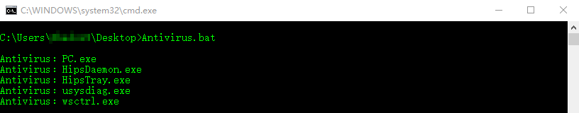

# Antivirus-detection
* 程序源码用的[@r00tSe7en](#)老哥的“get_AV”项目。
* 原项目地址：https://github.com/r00tSe7en/get_AV
* 进程数据来源：[@r00tSe7en](https://github.com/r00tSe7en)、[@NS-Sp4ce](https://github.com/NS-Sp4ce)、[@3had0w](https://github.com/3had0w)、[@gh0stkey](https://github.com/gh0stkey/avList)。
* 其他类似项目：https://github.com/uknowsec/SharpAVKB

随手写了个批处理，不过存在一定漏报，因为用qprocess的缺陷就是进程名称过长后便无法查到！
* 清理痕迹：C:\Users\Administrator\AppData\LocalLow\Microsoft\CryptnetUrlCache\Content

